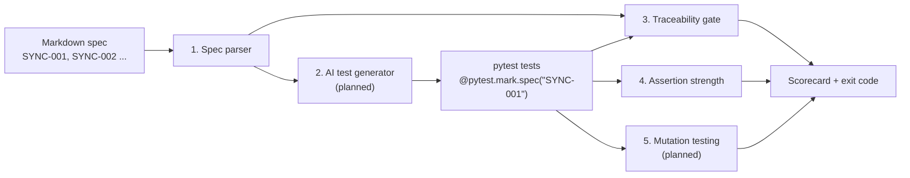

# specgate

AI writes the tests, deterministic gates decide if they're any good.

You write behaviour as Markdown Given/When/Then scenarios with stable IDs.
An AI generates pytest tests that claim those IDs. specgate then runs gates
that don't rely on AI judgement to decide whether the tests can be trusted.



| Stage | What it checks | Status |
|---|---|---|
| 1. Spec parser | Specs are well formed: unique IDs, When and Then present, steps in order | done |
| 2. Test generator | AI writes pytest tests from scenarios | planned |
| 3. Traceability | Every scenario has a test; no test claims an unknown ID | done |
| 4. Assertion strength | Every test has at least one assertion that can fail on a wrong value (static `ast` analysis) | done |
| 5. Mutation | Tests fail when the code under test is broken | planned |

## Quick start

```bash
python3.12 -m venv .venv
source .venv/bin/activate
pip install -e ".[dev]"

pytest                                   # specgate's own tests + the example's
specgate trace \
  --specs examples/identity_sync/specs \
  --tests examples/identity_sync/tests   # exit 0 = pass, 1 = gate failed, 2 = bad input
specgate assertions \
  --tests examples/identity_sync/tests   # same exit codes
```

## Catching coverage theater

`examples/identity_sync/theater/` holds six tests that claim every scenario,
pass, and pass the traceability gate, yet would not notice if `plan_sync()`
returned the wrong actions. Stage 4 flags all of them:

```
$ specgate assertions --tests examples/identity_sync/theater
Assertion strength: FAIL
  0/6 tests have a strong assertion
    WEAK  .../test_coverage_theater.py::test_new_hire_gets_an_account  [SYNC-001]
      line 24: only checks the value is not None
    MISSING  .../test_coverage_theater.py::test_rehire_re_enables_the_existing_account  [SYNC-003]
      no assertions
    WEAK  .../test_coverage_theater.py::test_conflicting_roles_are_flagged_not_applied  [SYNC-005]
      line 55: compares a value with itself
    ...
```

## Writing a spec

```markdown
## SYNC-001: New hire gets an account
- Given an active HR record for "e100" with roles "engineer"
- And no account exists for "e100"
- When the sync runs
- Then an account is created for "e100" with roles "engineer"
```

And the test that claims it:

```python
@pytest.mark.spec("SYNC-001")
def test_new_hire_gets_an_account(): ...
```

## Example target

`examples/identity_sync/` is a small, fictional identity provisioning sync:
it compares HR records with identity accounts and plans create, disable,
re-enable, role change and flag-for-review actions. It exists to be tested
by specgate; it is not modelled on any real employer's code.

## Layout

```
src/specgate/        the tool
  spec.py            stage 1: Markdown spec parser
  traceability.py    stage 3: traceability gate
  assertions.py      stage 4: assertion-strength gate
  cli.py             `specgate` command
tests/               specgate's own tests
examples/identity_sync/
  specs/             the example spec
  identity_sync.py   the example target
  tests/             tests claiming the spec IDs
  theater/           deliberately useless tests that stage 4 catches
docs/design-notes.md design choices and Java equivalents
```
